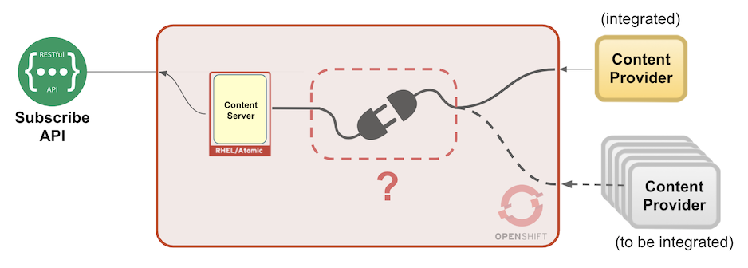

# Introduction to the Lab Solution

The Lab exercises you're about to follow are proposing a use case where users request content on demand. Users can browse over a list of different content feeds and subscribe to it.

The content could be of very different nature, i.e. financial, news, media. This implies our organisation having close partnership with different content providers. Our solution sits in the middle, integrating content providers with final users consuming data.

As usual, there are many ways to build such a solution, but the goal on this Lab is to experiment with new techniques that can bring added value when compared to the traditional approaches.

Some of the benefits explored are:

- Minimise resource usage when content is not consumed.

- Minimise impact on the platform when a new content provider is integrated.

- Minimise effort of integrating new providers.

- Clean decoupling between the platform's systems.

 

The overall picture would look as follows:

You will be closely involved in the implementation of the block marked with a big question mark, and we hope you can bring great ideas !

 

---

## Lab index:

The group of lab exercises below drive the student to build and deploy the architecture (based on the proposed use case). The exercises are divided in different chapters to help the student getting familiar with the different technologies and components playing a part in the solution.

The Lab is split in the following chapters: 

1. Hands-on with Camel-K. 
1. Hands-on with AMQ-Streams.
1. Platform Implementation (part 1): Integrate the Content Provider
1. Platform Implementation (part 2): Register the Camel-K integration
1. : 