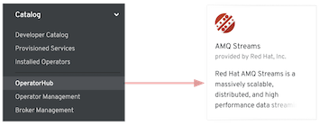
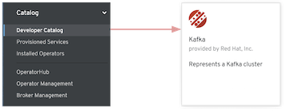
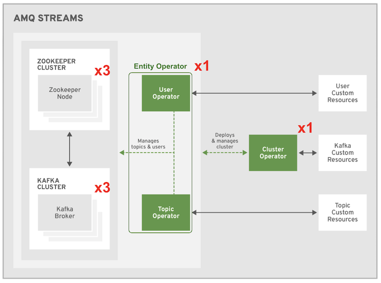

# Hands-on with AMQ-Streams

##  Install AMQ-Streams's Operator

The very first step into AMQ-Streams to install the Cluster Operator.


## Deploy the AMQ-Streams Operator

  1. create a new namespace

          oc new-project lab-{user}-kafka

      where `{user}` is your chosen username.

  2. From OCP, ensure you're on the new namespace and browse the catalogue to choose AMQ-Streams's operator

      

      click the `Install` button, and select the specific namespace you just created for AMQ-Streams:

      

      Leave other options to their default value.

      click the `Subscribe` button. This action should kick off the installation of the AMQ-Streams operator, and after few moments you should see a pod deployed similar to the image below:

      

      Once the pod is running, navigate to the _"Developer Catalog"_ menu and select to install a _Kafka_ cluster:

      

      > **WARNING:** you may get a 404 error at first, the Operator installation may still be working behind the scenes, if this is the case, try again a bit later.

      Click on the `Create` button, and accept the default YAML by clicking `Create` at the bottom of the screen.

      The operator will start deploying AMQ-Streams with the following architecture:

      

      and with the following pods:

      - 1 x Cluster Operator
      - 1 x Entity Operator (running the User and Topic Operators)
      - 3 x Zookeper Nodes
      - 3 x Kafka Brokers

      After few moments all the pods should be deployed and ready, if you execute the command:

            oc get pods

      you should see:

      ```shell
      NAME                                            READY   STATUS
      amq-streams-cluster-operator-5674d46657-v5mdg   1/1     Running
      my-cluster-entity-operator-ddbfb4999-kp7zm      3/3     Running
      my-cluster-kafka-0                              2/2     Running
      my-cluster-kafka-1                              2/2     Running
      my-cluster-kafka-2                              2/2     Running
      my-cluster-zookeeper-0                          2/2     Running
      my-cluster-zookeeper-1                          2/2     Running
      my-cluster-zookeeper-2                          2/2     Running
      ```

# Test the cluster with Camel-K

Your cluster is now ready and you already learnt in the previous chapter the basics of Camel-K, so you're ready to create integrations to interact with Kafka.

You should have by now two namespaces created:

 - **`lab-{user}`** (where CamelK resides)
 - **`lab-{user}-kafka`** (where Kafka runs)

where `{user}` is your chosen username.

The aim of this part of the lab is to complete the following flow:


## Create a Camel-K Kafka producer

Ensure you switch back to Camel-K's namespace:

    oc project lab-{user}

This time we will use XML to define the Camel route definition as we're aiming to complete our final solution using XML.

To test our Kafka cluster, we'll simply produce a traffic of 10 messages using Camel-K and we will also create a consumer to process the messages.

If you deployed the Kafka cluster following the instructions, you should be able to connect as a broker client using the following service URI:

    my-cluster-kafka-brokers.lab-{user}-kafka.svc:9092

where `{user}` is your chosen username. Use this service address in the Camel definitions below.

Create an XML file with the following name:

 - `producer.xml`

containing the following definition:

```xml
<routes xmlns="http://camel.apache.org/schema/spring">
    <route>
        <from uri="timer:producer?repeatCount=10"/>
        <setBody>
            <simple>message ${exchangeProperty.CamelTimerCounter}</simple>
         </setBody>
        <log message="sending: ${body}"/>
        <to uri="kafka:lab-test?brokers=YOUR_BROKER_SERVICE_URI"/>
    </route>
</routes>
```
where `YOUR_BROKER_SERVICE_URI` is the service URI corresponding to your Kafka service.

> **Note:** The Camel Kafka component is configured to use the topic `lab-test` which does not exist in the cluster yet. However the default installation is configured to automatically create the topics when clients attempt to use them.

> **Be patient:** Again, because we're using for the first time the Kafka component, it may take some time to build.

Run the integration with the command (DEV mode):

    kamel run --dev producer.xml

When the integration runs, you should see just 10 messages sent to Kafka as the timer is configured with a limit using the parameter `repeatCount=10`.

If all goes well, you should see in the output logs the following entries:

```
... timer://producer] route1 - sending: message 1
... timer://producer] route1 - sending: message 2
... timer://producer] route1 - sending: message 3
...                    ...                     ...
... timer://producer] route1 - sending: message 10
```

you can stop now the integration with <kbd>ctrl</kbd>+<kbd>c</kbd>, and list the topics available in Kafka with the following command:

    oc get kt -n lab-{user}-kafka

where `{user}` is your chosen username.

> **Note:** `kt` is an abbreviation of `kafkatopic`.

The result of the above should show:

```
NAME       PARTITIONS   REPLICATION FACTOR
lab-test   1            1
```

which confirms the topic was auto-created.

</br>

## Create a Camel-K Kafka consumer


Let's now define the Camel-K consumer. Create an XML file with the following name:

 - `consumer.xml`

containing the following definition:

```xml
<routes xmlns="http://camel.apache.org/schema/spring">
    <route>
        <from uri="kafka:lab-test?brokers=YOUR_BROKER_SERVICE_URI&amp;seekTo=beginning"/>
      	<log message="${body}"/>
    </route>
</routes>
```
where `YOUR_BROKER_SERVICE_URI` is the service URI corresponding to your Kafka service.

Run the integration with the command (DEV mode):

    kamel run --dev consumer.xml

When the integration runs, you should see just 10 messages sent to Kafka as the timer is configured with a limit using the parameter `repeatCount=10`.

If all goes well, you should see in the output logs the following entries:

```
... KafkaConsumer[lab-test]] route1 - message 1
... KafkaConsumer[lab-test]] route1 - message 2
... KafkaConsumer[lab-test]] route1 - message 3
...                    ...                   ...
... KafkaConsumer[lab-test]] route1 - message 10
```

you can stop now the integration with <kbd>ctrl</kbd>+<kbd>c</kbd>.

Because Kafka keeps the events in storage, the stream can be replayed by consumers. Our Camel consumer definition was parametrised with `seekTo=beginning` which indicates the consumer to fetch events from the beginning of the topic.

If you launch again the Camel-K consumer you should get the same result where 10 messages get processed.