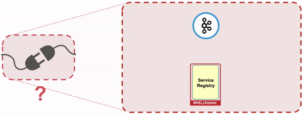
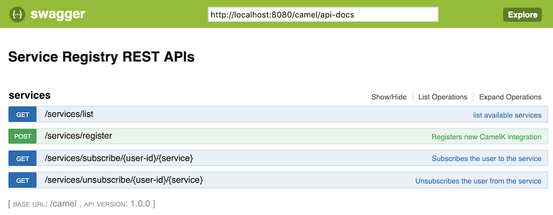
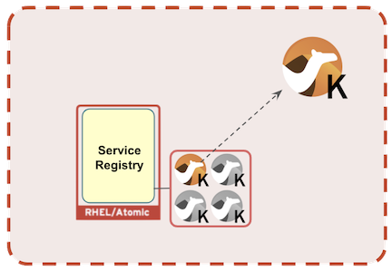

# Register the Camel-K integration

## Chapter introduction

You have now built the main body of the Camel-K definition to integrate the GBP/EUR prices stream which ends up in a Kafka Topic.

In this chapter we're introducing one of the key components of our platform's architecture: the _Service Registry_. This is an application (Fuse based) that has been built specially for the lab to help you complete our example use case.

We're unveiling in this chapter the mechanics of how Camel-K integrations should work in our Content Server solution. The role of the _Service Registry_ will be to spin Camel-K integrations according to the demand from users.

In other words, when there is demand from a user (a subscription), a GBP-EUR Camel-K integration will be created to provide a stream to the user.

The _Service Registry_ will also be responsible to destroy the integration when the subscription ends. For simplicity we will only allow 1 minute subscriptions for the exercise. When the subscription expires, the _Service Registry_ will destroy the integration.

The image below illustrates the mechanics of the above description:



Before we proceed to register your Camel-K integration from the previous chapter, let's get more familiar with the _Service Registry_

## Inspect the _Service Registry_

To demonstrate how the _Service Registry_ operates, let's inspect first the REST APIs that it exposes.

Let's open a tunnel to easily work with the _Service Registry_:

1. get the pod where it runs:

        oc get pods | grep serviceregistry

    The output should include the running `<pod>` for Service Registry

2. execute a port-forward command to the pod:

        oc port-forward <pod> 8080

    for example:

        oc port-forward serviceregistry-app-1-bv6wf 8080

Once the tunnel open, you can obtain the Swagger definition from a Swagger UI, using a Swagger plugin, or from the PetStore example UI at:

    https://petstore.swagger.io/

Use the following URL to obtain the Service Registry definition:

    http://localhost:8080/camel/api-docs

And you should be able to visualise:



If you run the REST API `/services/list` from the UI, or running the following cURL command:

    curl http://localhost:8080/camel/services/list

you should obtain the following JSON response back:

```json
{
  "services" : [ {
    "name" : "demo",
    "description" : "Demo service to showcase the Registry Service."
  } ]
}
```

The above response indicates the _Service Registry_ has been preloaded with a `demo` integration.

</br>

---

## Subscribe to the `demo` service

We can actually trigger the `demo` integration by invoking the REST Subscribe API:

- GET /camel/services/subscribe/{user-id}/{service}

Two parameters are required to be passed, the name of the service (`demo`) and the `user-id` subscribing to the service.

Execute the following cURL command:

    curl http://localhost:8080/camel/services/subscribe/student/demo

The above action should have triggered the `demo` Camel-K integration registered in the _Service Registry_.

What actually happens behind the scenes when you invoke the REST API is that the _Service Registry_ interacts with the Camel-K operator to spin dinamically a Camel-K integration, similar to when in the introduction chapters you used the `kamel` client to create integrations.


Display the new pod with:

    oc get pods | grep demo

The _Service Registry_ uses the following name pattern when creating integrations:

- int-{name}-{user}-id

where:
-  `int` is an abreviation of `integration`
- `name` is the name of the integration
- `user` is the client subscribed to the service

You can display the logs with:

    oc logs -f <pod>

where `<pod>` is the Camel-K pod. 


The output logs should show something similar to:

```
... timer://demo] route1 - demo integration for user: student
... timer://demo] route1 - demo integration for user: student
```

## Unsubscribe from the `demo` service

The deployed `demo` Camel-K integration will run indefinitely until we invoke the REST _Unsubscribe_ API against the _Service Registry_.

To destroy the `demo` integration the _Service Registry_ exposes the REST _Unsubscribe_ API:

- GET /camel/services/unsubscribe/{user-id}/{service}

Two parameters are required to be passed, the name of the service (`demo`) and the `user-id` subscribing to the service (`student`).

Behind the scenes, the _Service Registry_ interacts with the Camel-K operator to instruct the termination of the integration as depicted below:


Execute the following cURL command:

    curl http://localhost:8080/camel/services/unsubscribe/student/demo

The above action should have sent the signal to destroy the `demo` Camel-K integration, and the pod should disappear after a moment.


</br>

---

## Register your GBP/EUR integration

There is one last REST service exposed by the _Service Registry_ which is intended to register new Camel-K integrations to the platform.

The idea here is to have a mechanism to easily integrate Content Providers to the platform when finding new Partners to adhere to the content portfolio offered to customers.

This means the _Service Registry_ keeps a private repository of Camel-K integrations which represent the collection of available Content Providers that can be used.



Say you made a deal with a betting company that is able to provide live feeds of current sport events. We could integrate the feeds building a Camel-K integration and registering the new service without impacting any other building block of the platform.

Let's do exactly that with your Camel-K GBP/EUR integration.

To register a new Camel-K integration, the _Service Registry_ exposes the REST _Register_ API:

- POST /camel/services/register

The service requires meta data describing the integration, and additionally the Camel-K integration itself.
 
To illustrate with an example, look at the sample below:

 - Header `service`: JSON format

    ```JSON
    {
        "name":"sample",
        "description": "Sample service to show how to post register a new integration"
    }
    ```

 - Payload: Camel-K integration (in XML)

    ```XML
    <routes xmlns="http://camel.apache.org/schema/spring">
        <route>
            ...
    ```

Now, with your tunnel to the _Service Registry_ still open, execute the following `cURL` command to register your Camel-K integration:

```shell
curl -X POST \
-H 'Content-Type: application/json' \
-H 'service: {"name":"gbp-eur","description": "exchange rate for currency GBP-EUR"}' \
-d "@gbp-eur.xml" \
'http://localhost:8080/camel/services/register'
```

If the execution was successful, the GBP/EUR service should be included when listing the available services.

Invoke the REST _List Services_ API to validate it was successfully registered:

    curl http://localhost:8080/camel/services/list

you should obtain the following JSON response back:

```json
{
  "services" : [ {
    "name" : "demo",
    "description" : "Demo service to showcase the Registry Service."
  }, {
    "name" : "gbp-eur",
    "description" : "exchange rate for currency GBP-EUR"
  } ]
}
```
where your Camel-K service should be included.

</br>

---
## Test your GBP/EUR integration

Before you proceed, let's make sure the Kafka Topic is reset so that we can verify it got new events from the test you're about to run.

- To delete the Kafka Topic execute:

        oc delete kt lab-test -n lab-{user}-kafka

    where `{user}` is your chosen username.

    Double check the Kafka topic does not exist:

        oc get kt -n lab-{user}-kafka

    </br>


> **Reminder:** ensure your tunnel to the _Service Registry_ is active to keep interacting with it.

Now, as you did with the `demo` integration, you can test out your service by executing the following cURL command:

    curl http://localhost:8080/camel/services/subscribe/student/gbp-eur

> **Please note:** how while the `user-id` remains as `student`, the service is now `gbp-eur`.

The above action should have triggered the `GBP/EUR` Camel-K integration registered in the _Service Registry_.

Display the new pod with:

    oc get pods | grep student

Display the logs with:

    oc logs -f <pod>

where `<pod>` is the Camel-K pod. 

You should see GBP/EUR prices showing up in your terminal output similar to:

```
... KafkaProducer[lab-test]] route1 - rate: 1.1056
... KafkaProducer[lab-test]] route1 - rate: 1.1003
... KafkaProducer[lab-test]] route1 - rate: 1.1147
...                 ...                  ...
... KafkaProducer[lab-test]] route1 - rate: 1.1183
```

Now unsubscribe from the service to destroy the `GBP/EUR` by executing the following cURL command:

    curl http://localhost:8080/camel/services/unsubscribe/student/gbp-eur

To ensure the POD has been discarded, run the command:

    oc get pods | grep student

You should be able to validate the integration is no longer running.

Finally, we can inspect the Kafka Topic to ensure we indeed got a stream of GBP/EUR prices injected into it. Let's run the Camel-K consumer you implemented in Lab 02:

    kamel run --dev consumer.xml

If everything went according to plan, you should see GBP/EUR prices showing up in your terminal output similar to:

```
... KafkaConsumer[lab-test]] route1 - 1.1056
... KafkaConsumer[lab-test]] route1 - 1.1003
... KafkaConsumer[lab-test]] route1 - 1.1147
...                 ...                  ...
... KafkaConsumer[lab-test]] route1 - 1.1183
```

you can stop the consumer with <kbd>ctrl</kbd>+<kbd>c</kbd>.


</br>

---
## Implement auto-destruction

In the above procedure we manually activated (subscribed) and deactivated (unsubscribed) the Camel-K integrations by invoking the _Service Registry_ REST APIs.

The end goal is to have a solution that is completely automatic. Integrations will be activated by the Content Server, but deactivations need to be managed.

There is many ways to think on how to deactivate a subscription but to make things easy we will simply allow 1 minute subscriptions, and when expired the Camel-K instegration should be destroyed.

We'll take a simple approach to expire subscriptions within our Camel-K definitions. We just need to run a timer, and when triggered, execute a API call against the _Service Registry_.

To implement our strategy we need to include a new route with the timer functionality.

Edit your integration:

 - gbp-eur.xml

and include the following route:

```xml
    <route id="self-destroy">
        <from uri="timer:self-destroy?delay=60000&amp;repeatCount=1"/>

        <log message="about to send destroy signal..."/>

        <setHeader name="CamelHttpMethod">
            <simple>GET</simple>
        </setHeader>

        <to uri="http4:serviceregistry-app:8080/camel/services/unsubscribe/{{client.id}}/gbp-eur"/>
    </route>
```

> **Please note:** how the HTTP invocation includes the parameter `{{client.id}}`. This is a property placeholder the _Service Registry_ understands and will be mapped with the `user-id`.

> **Please note:** how the timer includes that parameter `delay=60000` (milliseconds) to indicate it should trigger after 1 minute of execution.

> **Please note:** how the parameter `repeatCount=1` indicates it just needs to run once, although we could make it repeatable to ensure it gets destroyed.

Save the code changes.

We just need now to update the Camel-K service within the _Service Registry_ which currently has the old version. We can do this my simply re-registering the new version.

> **Reminder:** ensure your tunnel to the _Service Registry_ is active to keep interacting with it.

Execute the following `cURL` commange:

```shell
curl -X POST \
-H 'Content-Type: application/json' \
-H 'service: {"name":"gbp-eur","description": "exchange rate for currency GBP-EUR, v2.0"}' \
-d "@gbp-eur.xml" \
'http://localhost:8080/camel/services/register'
```

To double check your v2.0 integration was uploaded, obtain the list of services from the _Service Registry_ by running the cURL:

    curl http://localhost:8080/camel/services/list

you should obtain the following JSON response back:

```json
{
  "services" : [ {
    "name" : "demo",
    "description" : "Demo service to showcase the Registry Service."
  }, {
    "name" : "gbp-eur",
    "description" : "exchange rate for currency GBP-EUR, v2.0"
  } ]
}
```

> **Please note** the description of the 'gbp-eur' service should show `v2.0`.

Ok, if properly updated, subscribe to the service and wait 1 minute to validate it self-destroys after the time has passed.

Subscribe by running the cURL command:

    curl http://localhost:8080/camel/services/subscribe/student/gbp-eur

Then, watch the pods for 1 minute with:

    oc get pods -w

After more or less one minute, you should be able to see the GBP/EUR pod through the following statuses:

```
int-gbp-eur-student-id-7b9c6fbbb8-gg4pb    1/1     Running     0          29s
...
int-gbp-eur-student-id-7b9c6fbbb8-gg4pb   1/1   Terminating   0     100s
...
int-gbp-eur-student-id-7b9c6fbbb8-gg4pb   0/1   Terminating   0     102s

```

</br>

---

You've completed the chapter and can now jump to the next one. 